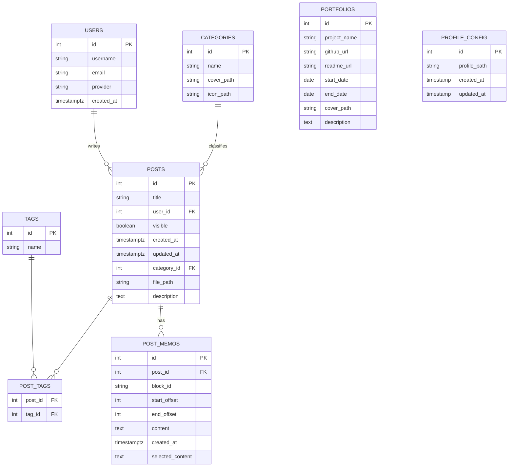

# 個人部落格全端專案

## 專案簡介

我平常習慣用 **Markdown** 記錄學習內容，方便之後查閱。但如果只放在 GitHub 託管，存取與編輯都不夠順手（特別是行動端）。因此我開發了這個 **個人部落格**：

* **前台**：所有使用者都能瀏覽與閱讀文章
* **後台**：整合 **Google OAuth**，登入後可進行筆記「上傳／編輯／新增／刪除」與閱讀

同時這也是我給自己安排的一個 **全端專案**。因為這不是公司專案，也沒有時程壓力，所以就打算自己慢慢規劃，當成訓練系統設計的練習場。平常能自己動手就自己來，真的卡關才會讓 AI 出手幫忙，就像請個助教給點小提示。AI 對我來說就是輔助工具，用得巧能加速學習，但最重要的還是把東西內化成自己的。

---

## 技術棧 (Tech Stack)

* **框架**：Next.js 15
* **前端工具**：React Query、React Table、Shadcn、Zustand...
* 資料庫：PostgreSQL
* **檔案儲存**：Amazon S3（非結構化資料）
* **部署**：AWS EC2、Nginx
* **AI API**：OpenAI API

---

## 功能特色 (Features)

* 基於 **mdx-editor** 的 Markdown 編輯器
* 文章 **Highlight**（後台便於檢視與修訂）
* OpenAI API 協助文章編輯（語句修飾、加長／縮短、錯別字檢查）
* 後台整合 Google OAuth 權限管理

---

## 為什麼選 mdx-editor，而不是 tiptap／quill？

我選擇 mdx-editor 的原因，主要是因為它以 Markdown 為核心設計，和我平常寫筆記的習慣完全契合。由於我的筆記幾乎都是用 Markdown 格式撰寫，未來如果要轉換平台，也能保持很高的相容性。

相比之下，tiptap 雖然也支援 Markdown，但匯入與匯出的功能需要試用或付費帳號，使用門檻相對較高。對我來說，mdx-editor 的體驗反而更直覺、簡單，也更符合我當下的需求。

另外，mdx-editor 的討論度在社群中逐漸升高，整體氛圍相當活躍，讓我覺得它的未來發展性不錯，因此更有信心投入使用。

> Ps. 老實說我其實也蠻想試試 tiptap，因為在社群裡大家最推崇的就是它的開發體驗好，不過在目前這個情境下，mdx-editor 還是比較符合我的需求。

---

## 架構設計 (Architecture)

（建議未來可補上系統架構圖／流程圖，說明前端、後端、資料庫、S3 的互動）

---

## Database Schema（僅展示 ER Diagram）

> 完整 SQL 請見根目錄的 **[db.sql](./db.sql)**



---

## 開發理念與選擇 (Philosophy)

* **不使用 ORM（Drizzle／Prisma）**：先以 `pg` 手寫 SQL 深入理解資料庫行為與查詢邏輯，累積排錯經驗。
* 專案穩定後再考慮導入 ORM，提升團隊協作與維護性。
* 媒體檔案改以 **Amazon S3** 管理；原本曾考慮自架 MinIO，但既然部署在 AWS EC2，直接使用同生態服務更省維運成本。

---

## 部署 (Deployment)

* 以 **AWS EC2** 佈署應用，**Nginx** 作為代理伺服器。
* 圖片與靜態檔案由 **S3** 儲存與服務。

> （可於此處補充 Docker／docker-compose、環境變數與 CI/CD 流程）

---

## TODO（上線後優化方向）

* 導入 ORM（像是 Drizzle／Prisma）主要是想讓程式碼更好維護、更好看。現在用 `pg` 手寫 SQL 雖然很扎實，但隨著功能越加越多，SQL 查詢跟關聯會變得有點雜亂。ORM 可以幫忙把這些查詢用更結構化的方式表達，schema 跟程式碼也能同步更新，不用自己到處追。少掉一堆重複 SQL，維護起來會輕鬆很多，也能讓之後的擴充更順手。
* 新增瀏覽量統計
* 筆記支援動態生成 TOC
* 筆記支援動態生成 Catalog
* 建立 CI/CD（GitHub Actions → AWS）
* 加強 SEO（自動 sitemap、meta）

---


## 安裝與啟動 (Installation & Usage)

1. 確認環境已安裝 **Node.js 20+**。
2. 安裝套件：

   ```bash
   pnpm install
   ```
3. 建立並設定 `.env` 環境檔案：

   ```bash
   NEXTAUTH_SECRET=《需自行設定》
   AUTH_GOOGLE_ID=《需自行設定》
   AUTH_GOOGLE_SECRET=《需自行設定》
   AUTH_TRUST_HOST=true
   NEXTAUTH_URL=http://localhost:3000

   AWS_ACCESS_KEY_ID=《需自行設定》
   AWS_SECRET_ACCESS_KEY=《需自行設定》
   AWS_REGION=《需自行設定》

   # 本地 PostgreSQL 設定
   DB_HOST=localhost
   DB_PORT=5432
   DB_NAME=《需自行設定》
   DB_USER=《需自行設定》
   DB_PASSWORD=《需自行設定》

   S3_BUCKET_NAME=《需自行申請》

   OPENAI_API_KEY=《需自行申請》
   ```
4. 啟動開發伺服器：

   ```bash
   pnpm run dev
   ```


