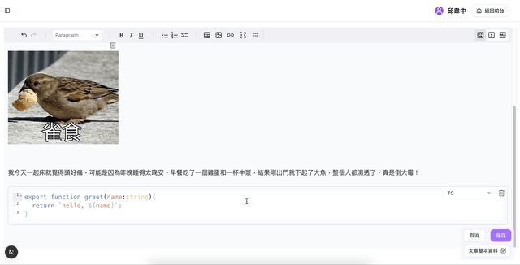

# 個人部落格全端專案

## 專案簡介

我平常習慣用 **Markdown** 記錄學習內容，方便之後查閱。但如果只放在 GitHub 託管，存取與編輯都不夠順手（特別是行動端）。因此我開發了這個 **個人部落格**：

* **前台**：所有使用者都能瀏覽與閱讀文章
* **後台**：整合 **Google OAuth**，登入後可針對筆記、分類、標籤、作品集、修訂紀錄、個人簡介等資料表進行完整的新增、編輯、刪除與查詢（CRUD）操作

同時這也是我給自己安排的一個 **全端專案**。因為這不是公司專案，也沒有時程壓力，所以就打算自己慢慢規劃，當成訓練系統設計的練習場。平常能自己動手就自己來，真的卡關才會讓 AI 出手幫忙，就像請個助教給點小提示。AI 對我來說就是輔助工具，用得巧能加速學習，但最重要的還是把東西內化成自己的。

---

## 技術棧 (Tech Stack)

### 前端技術
* **框架**：Next.js 15
* **核心函式庫**：Mdx Editor、Next Mdx Remote Client、Pg 等
  > 完整套件列表請見 [package.json](./package.json)

### 資料層
* **資料庫**：PostgreSQL
* **檔案儲存**：Amazon S3（非結構化資料）

### 雲端服務 & 部署
* **主機環境**：AWS EC2
* **Web Server**：Nginx
* **CDN**：Amazon CloudFront
  > 確保只有 CloudFront 能存取私有 S3，外部無法直接打 S3 URL

### AI 整合
* **AI API**：OpenAI API 
  > 詳見 [AI 協助編輯](#ai-協助編輯)

---

## 功能特色 (Features)

### Markdown 編輯器
基於 **mdx-editor** 打造的編輯器，提供直覺的 Markdown 編輯體驗。


### 文章 Highlight 功能
便於後台檢視與修訂的文章重點標記系統。


### AI 協助編輯
整合 **OpenAI API** 提供文章編輯功能，包含語句修飾、內容加長／縮短、錯別字檢查等。

> 有時候在寫筆記或編輯內容時，中文表達會卡住，腦袋有畫面但文字卻湊不出來。這種情況下，如果有個幫手在旁邊幫忙調整、潤飾，就能快很多。對我來說，把 AI 加進來不是為了「炫技」，而是想讓自己少一點疲累，把精力留在更重要的地方。



### 後台管理與權限
後台整合 **Google OAuth**，僅限登入後才能進行特定操作（如新增、刪除、修改筆記、分類、標籤、作品集等資料）。


---

## DB Schema

> 完整 SQL 請見根目錄的 **[db.sql](.docs/db.sql)**


---

## 技術選擇與考量 (Dev Considerations)

### 資料庫的操作
一開始做這個專案時，我並沒有急著用 ORM（像 Drizzle 或 Prisma），而是先用 pg 自己手寫 SQL。原因很單純，就是想先親手去感受資料庫的行為，實際踩過一些坑，累積排錯的經驗。等到專案慢慢走向穩定，再把 ORM 引進來，這樣能更清楚感受到 ORM 在協作與維護上的好處。

### 非結構化資料庫的選擇
在檔案儲存上，我原本也考慮過自己架 [MinIO](https://www.min.io/)，不過後來仔細想想，既然系統就是要部署在 AWS EC2 上，那直接用 Amazon S3 不就更順手嗎？這樣還能省下額外的維運成本，讓整個架構簡單很多。

> 雖然 MinIO 的 API 與 Amazon S3 相容，但考量目前專案架構，直接採用 Amazon S3 比較合適

### 編輯器套件的選擇
至於編輯器的部分，我最後選了 mdx-editor。原因是它以 Markdown 為核心設計，剛好跟我平常寫筆記的習慣完全對得上。因為我的筆記幾乎全都是 Markdown 格式，所以未來如果要轉換平台，也能保持高度相容性。相比之下，tiptap 雖然功能更完整，也支援 Markdown，但匯入和匯出的功能需要試用或付費帳號，對我來說門檻稍微高了一些。相較之下，mdx-editor 更直覺、更簡單，剛好滿足我當下的需求。而且它最近在社群裡的討論度越來越高，發展也算有前景，讓我更有信心投入使用。

> Ps. 老實說，我也蠻想試試 tiptap，因為它在社群裡最被推崇的就是「開發體驗超好」。只是這次的專案定位，讓我更傾向選 mdx-editor 😅。

---

## 上線後優化方向（TODO）

* 導入 ORM（像是 Drizzle／Prisma）主要是想讓程式碼更好維護、更好看。現在用 `pg` 手寫 SQL 雖然很扎實，但隨著功能越加越多，SQL 查詢跟關聯會變得有點雜亂。ORM 可以幫忙把這些查詢用更結構化的方式表達，schema 跟程式碼也能同步更新，不用自己到處追。少掉一堆重複 SQL，維護起來會輕鬆很多，也能讓之後的擴充更順手。
* 新增瀏覽量統計功能
* 筆記支援動態生成 TOC
* 加強 SEO（自動 sitemap、meta）

---


## 安裝與啟動 (Installation & Usage)

1. 確認環境已安裝 **Node.js 20+**。
2. 安裝套件：

   ```bash
   pnpm install
   ```
3. 建立並設定 `.env` 環境檔案：

   ```bash
   NEXTAUTH_SECRET=《需自行設定》
   AUTH_GOOGLE_ID=《需自行設定》
   AUTH_GOOGLE_SECRET=《需自行設定》
   AUTH_TRUST_HOST=true
   NEXTAUTH_URL=http://localhost:3000

   AWS_ACCESS_KEY_ID=《需自行設定》
   AWS_SECRET_ACCESS_KEY=《需自行設定》
   AWS_REGION=《需自行設定》

   # 本地 PostgreSQL 設定
   DB_HOST=localhost
   DB_PORT=5432
   DB_NAME=《需自行設定》
   DB_USER=《需自行設定》
   DB_PASSWORD=《需自行設定》

   S3_BUCKET_NAME=《需自行申請》

   OPENAI_API_KEY=《需自行申請》
   CF_DOMAIN=《需自行申請》
   ```
4. 啟動開發伺服器：

   ```bash
   pnpm run dev
   ```


